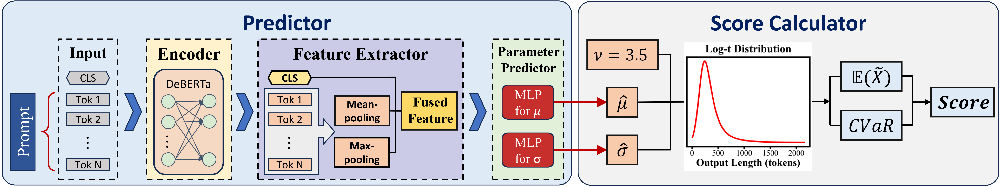

# Scheduling LLM Inference with Uncertainty-Aware Output Length Predictions

This repository contains the source code for the paper *"Scheduling LLM Inference with Uncertainty-Aware Output Length Predictions"*.

## Overview


## Repository Structure

```
.
├── train/
│   └── model_train.py                  # Training code for TIE predictor
│
└── vllm/v1/core/sched/
    ├── scheduler.py                    # Upstream implementation of the scheduler
    ├── request_queue.py                # Implementation of the waiting request queue
    ├── ua_predictor.py                 # Invocation of the parameter predictor
    └── ua_score_calculator.py          # Implementation of the score calculator
```


## Installation

To deploy this project, please refer to the official [vLLM installation guide](https://docs.vllm.ai/en/latest/getting_started/installation.html).

## Configuration

The following `"xxx"` placeholders in the source code must be set before use.

| File | Variable | Description |
|------|----------|-------------|
| `vllm/v1/core/sched/ua_predictor.py` | `MODEL_CONFIGS["logt"]["model_path"]` | Path to the trained TIE predictor checkpoint |
| `vllm/v1/core/sched/ua_predictor.py` | `encoder_path` in `load_model()` | Path to the pre-trained encoder (e.g. DeBERTa) |
| `train/model_train.py` | `DATA_PATH` | Path to the training CSV (columns: `prompt`, `logt_mu`, `logt_sigma`) |
| `train/model_train.py` | `MODEL_PATH` | Path to the pre-trained encoder for training |
| `train/model_train.py` | `BASE_SAVE_DIR` | Directory for saving model checkpoints and results |

### Starting the server

```bash
bash start-server.sh <SCHEDULING_POLICY> <CUDA_VISIBLE_DEVICES> <PORT> <MODEL_PATH>
# Example:
bash start-server.sh ua 4,5 16666 /path/to/llm_model
```

For `ua`, one GPU is reserved for the predictor; the rest are used for tensor parallelism.

## Citation

```bibtex
@inproceedings{zheng2026scheduling,
  title={Scheduling {LLM} Inference with Uncertainty-Aware Output Length Predictions},
  author={Haoyu Zheng and Yongqiang Zhang and Fangcheng Fu and Xiaokai Zhou and Hao Luo and Hongchao Zhu and Yuanyuan Zhu and Hao Wang and Xiao Yan and Jiawei Jiang},
  booktitle={Forty-third International Conference on Machine Learning},
  year={2026},
  url={https://openreview.net/forum?id=I5IMkvVKd7}
}
```

